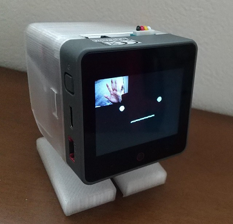

# AI_StackChan2_DevCam
robo8080さんの[AIｽﾀｯｸﾁｬﾝ2](https://github.com/robo8080/AI_StackChan2)をベースに、M5Stack CoreS3の内蔵カメラを扱うプログラムを組み込みました。
  

  

### 主な仕様
- 顔検出するとｽﾀｯｸﾁｬﾝとの会話を起動します。
  - LCD左側をタッチするとサイレントモードになり、顔検出しても会話を起動しなくなります。その代わり、サーボで顔を追従するようになります。
- ｽﾀｯｸﾁｬﾝの顔の隅にカメラ画像が表示されます。画像部分をタッチすると表示ON/OFFできます。
- AIｽﾀｯｸﾁｬﾝ2の既存機能
  - 額部分をタッチするとｽﾀｯｸﾁｬﾝが聞き取りを開始します。
  - LCD右側をタッチするとバッテリ残量を声で教えてくれます。

### 補足
- ｽﾀｯｸﾁｬﾝとお話するためには次のAPIキーが必要です。取得方法は[AIｽﾀｯｸﾁｬﾝ2のREADME](https://github.com/robo8080/AI_StackChan2_README/)を参照ください。
  - ChatGPT
  - Google Cloud TTS
  - VoiceVox
- フォルダ名が長いため、ワークスペースの場所によってはライブラリのインクルードパスが通らない場合があります。
なるべくCドライブ直下に近い場所をワークスペースにしてください。(例 C:\Git)
- カメラ画像を表示するために、Avatarライブラリをlibフォルダにコピーして変更を加えています（platformio.iniではロードしない）。
